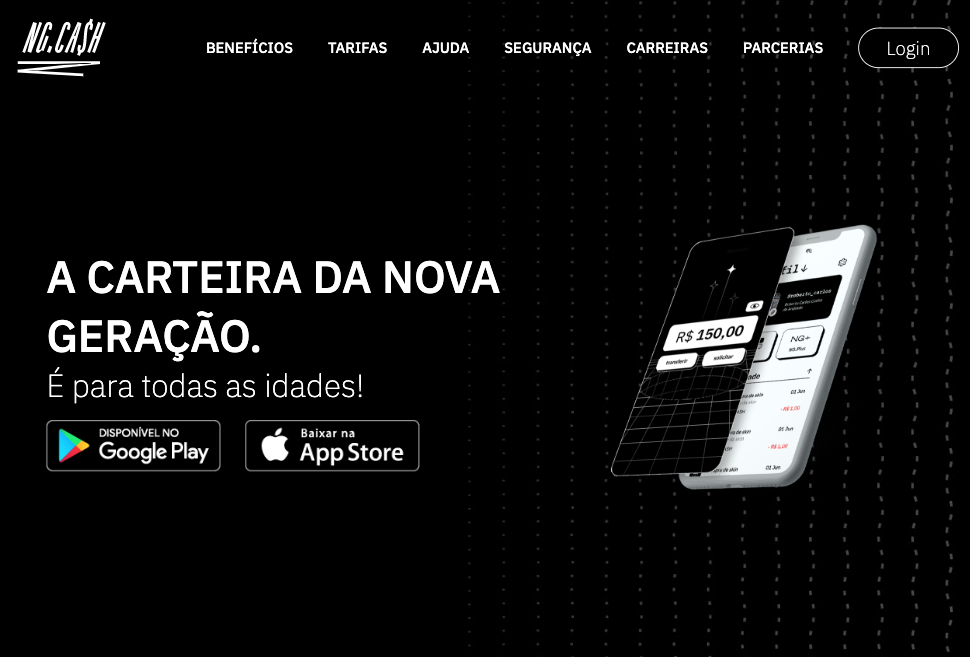
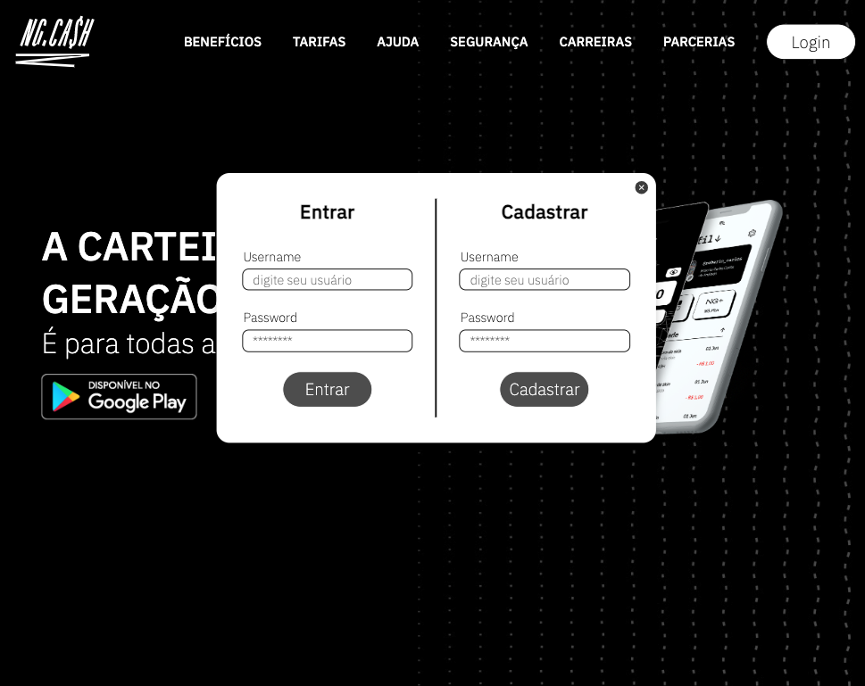
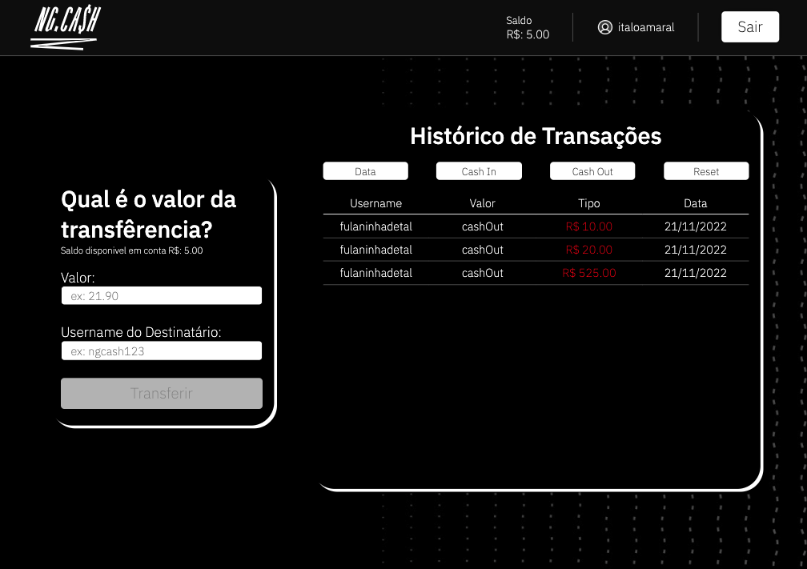

# NG.CASH 
###### by _[Italo Amaral](https://www.linkedin.com/in/italo-rockenbach-594082132/)_


## 📃 Sobre - About
<details>
  <summary > :brazil: Portuguese </summary>
  <p>
    Estruturar uma aplicação web fullstack, dockerizada, cujo objetivo seja possibilitar que usuários da NG consigam realizar transferências internas entre si.
  </p>
</details>

<details>
  <summary > :us: English </summary>
  <p>
    Structuring a fullstack, dockerized web application, whose objective is to enable NG users to be able to perform internal transfers between themselves.
  </p>

  <p><strong>Note:</strong> the application is currently only in Brazilian Portuguese</p>
</details>

## 🛠️ Ferramentas - Tools

## - Front End:
  - React
  - Typescript
  - React Router Dom
  - Context Api
  - React Hooks
  - Phosphor React Icons
  
## - Back End:
  - Node
  - Typescript
  - Express
  - Cors
  - Sequelize
  - md5
  - Jwt
  - Postgreesql

## ⚙️ Como executar - How to run

<details>
  <summary>:brazil: Portuguese </summary>
Você precisa ter instalado as seguintes ferramentas: Git, Docker e Docker Compose

Será necessário que a porta 3000 e 3001 estejam disponíveis para a aplicação, Postgresql usará a porta 5432 e o PG Adming usará a 5050

1 - Clone o repositório em uma pasta de sua preferencia 
```
git@github.com:ItaloRAmaral/DesafioTecnico-NG.git
```
2 - Entre na pasta `app` e suba o dockercompose, todas as depêndencias serão automaticamente instaladas
```
npm run compose:up   // para subir a aplicação
npm run compose:down // para parar completamente a aplicação
```
3 - Após rodar o comando, aguarde um pouco que a aplicação irá ficar disponivel nas seguintes rotas:

  `- Front End: http://localhost:3000`

  `- Back End: http://localhost:3001`

<details>
  <summary> Observação</summary>
  <p> Caso algum container insita em ficar com o status unhealty, você pode ainda acessar a aplicação localmente, instalando as dependências, tanto no <code>/app/frontend</code> quanto no <code>/app/frontend</code></p>

  <p>E logo após a instalação das dependências, rode os comandos <code>npm start</code> no Front End e o comando <code>npm run dev</code> no back end</p>

</details>
</details>

<details>
  <summary>:us: English </summary>
You need to have the following tools installed: Git, Docker and Docker Compose

It will be necessary that the ports 3000 and 3001 are available for the application, Postgresql will use port 5432 and PG Adming will use 5050

1 - Clone the repository in a folder of your choice
```
git@github.com:ItaloRAmaral/DesafioTecnico-NG.git
```

2 - Enter the `app` folder and raise the dockercompose, all dependencies will be automatically installed
```
npm run compose:up   // to start the application
npm run compose:down // to stop the application completely
```

3 - After running the command, wait a while for the application to be available at the following routes:

  `- Front End: http://localhost:3000`

  `- Back End: http://localhost:3001`

<details>
  <summary>Note</summary>
  <p> If any container insists on staying with the unhealty status, you can still access the application locally, installing the dependencies, both in <code>/app/frontend</code> and in <code>/app/frontend</code></p>

  <p>And after installing the dependencies, run the <code>npm start</code> command on the Front End and the <code>npm run dev</code> command on the back end</p>
</details>
</details>


# Back-End

## 1 - Rotas do Usuário - User Routes

<details>
  <summary>:brazil: Portuguese </summary>

###  Login

| Método | Funcionalidade             | URL                              |
| ------ | -------------------------- | -------------------------------- |
| `POST` | Realiza o login do usuário | http://localhost:3001/user/login |

Nessa requisição `POST` é necessário informar o seguinte JSON:

```
{
  "username": "Nome do Usuário",
  "password": "senha_secreta"
}
```

Esta rota retorna o seguinte JSON:
```
{
	"token": 'token_ultra_secreto',
	"username": "Nome do Usuário"
}
```
### Register

| Método | Funcionalidade             | URL                                 |
| ------ | -------------------------- | ----------------------------------- |
| `POST` | Realiza o login do usuário | http://localhost:3001/user/register |

Nessa requisição `POST` é necessário informar o seguinte JSON:

```
{
  "username": "Nome do Usuário",
  "password": "senha_secreta"
}
```
Esta requisição retorna o seguinte JSON 
```
{
	"id": id do usuário,
	"username": "Nome do Usuário",
	"password": "senha_secreta",
	"accountId": o id da conta do usuário,
	"account": {
		"id": o id da conta do usuário,
		"balance": 100 // por padrão é colocado 100 reais de balance para todo novo usuário
	},
	"token": "token_ultra_secreto"
}
```


### Informações do usuário

| Método | Funcionalidade                                    | URL                                |
| ------ | ------------------------------------------------- | ---------------------------------- |
| `GET`  | Recupera as informações do usuário e da sua conta | http://localhost:3001/user/account |

É necesário o envio de um token válido atravéz do headers

Nessa requisição `GET` é retornada as seguintes informações

```
{
  "id": 1,
  "username": "Nome do Usuário",
  "accountId": 1,
  "account": {
    "balance": 100,
  }
}
```
</details>

<details>
  <summary>:us: English</summary>

###  Login

| Method | Functionality             | URL                              |
| ------ | -------------------------- | -------------------------------- |
| `POST` | Performs the user login | http://localhost:3001/user/login |

In this `POST` request it is necessary to inform the following
  
```
  {
    "username": "User Name",
    "password": "secret_password",
  }
```

This route returns the following JSON

```
{
	"token": 'secret_token',
	"username": "User Name",
}
```

### Register

| Method | Functionality             | URL                              |
| ------ | -------------------------- | -------------------------------- |
| `POST` | Register the new user | http://localhost:3001/user/register |

In this `POST` request it is necessary to inform the following

```
  {
    "username": "User Name",
    "password": "secret_password",
  }
```

This route returns the following JSON
```
{
	"id": User Id,
	"username": "User Name",
	"password": "user_password",
	"accountId": account_id,
	"account": {
		"id": account_id,
		"balance": 100 // by default is set 100 reals for every new user
	},
	"token": "secret_token"
}
```

### User information

| Method | Functionality             | URL                              |
| ------ | -------------------------- | -------------------------------- |
| `GET` | Get the user information | http://localhost:3001/user/account |

It is necessary to send a valid token through the headers

In this `GET` request is returned the following information

```
{
  "id": 1,
  "username": "User Name",
  "accountId": 1,
  "account": {
    "balance": 100,
  }
}
```
</details>

## 2 - Rotas de Transferencia - Transaction routes

<details>
  <summary>:brazil: Portuguese </summary>

Todos as rotas abaixo necessitam de um token válido, que é gerado no login do usário, para poderem funcionar. Este token deve ser passado pelo `header` da requisição na chave `authorization`. 

| Método | Funcionalidade                        | URL                               |
| ------ | ------------------------------------- | --------------------------------- |
| `POST`   | Cria uma nova transação entre contas | http://localhost:3001/transaction/deposit |

Nessa requisição `POST` é necessário informar o seguinte JSON:

```
{
 "username": "nome do usuário a ser transferido",
 "amount": 5 // valor a ser tranferido
}
```

Essa rota retorna o seguinte JSON:
```
{
	"id": id da transferencia,
	"creditedAccountId": id da conta da pessoa que recebeu a transferencia,
	"debitedAccountId": id da conta da pessoa que fez a transferencia,
	"value": "valor da transferencia",
	"createdAt": "2022-11-21T23:32:28.436Z"
}

```

| Método | Funcionalidade                                   | URL                                      |
| ------ | ------------------------------------------------ | ---------------------------------------- |
| `GET`    | Retorna todas as transações do usuário           | http://localhost:3001/transaction/:accountId        |


Nessa requisição `GET` é retornada as seguintes informações

```
[
 {
   "id": 1, // id do usuário que está transferindo
   "debitedAccountId": 1, // id da conta que está sendo debitada
   "creditedAccountId": 2, // id da conta que está sendo creditada
   "value": 50, // valor a ser tranferido
   "createdAt": "2022-11-21T18:26:01.271Z", // data da transferencia
   "debitedAccount": {
        "id": 1,
        "user": {
        "username": "nome do usuário" // nome do usuário que está tranferindo
        "id": 1,
        }
    },
    "creditedAccount": {
        "id": 2,
        "user": {
        "username": "nome do usário" // nome do usuário que está recebendo
        "id": 2,
        }
    }
]
```
</details>

<details>
  <summary>:us: English </summary>

All routes below need a valid token, which is generated in the user login, to work. This token must be passed through the request `header` in the `authorization` key.

| Method | Functionality             | URL                              |
| ------ | -------------------------- | -------------------------------- |
| `POST` | Create a new transaction between accounts | http://localhost:3001/transaction/deposit |

In this `POST` request it is necessary to inform the following

```
{
 "username": "user name to be transferred",
 "amount": 5 // value to be transferred
}
```

This route returns the following JSON

```
{
  "id": transfer id,
  "creditedAccountId": id of the account of the person who received the transfer,
  "debitedAccountId": id of the account of the person who made the transfer,
  "value": "transfer value",
  "createdAt": "2022-11-21T23:32:28.436Z"
}

```

| Method | Functionality             | URL                              |
| ------ | -------------------------- | -------------------------------- |
| `GET` | Returns all user transactions | http://localhost:3001/transaction/:accountId |

In this `GET` request is returned the following information

```
[
 {
   "id": 1, // user id that is transferring
   "debitedAccountId": 1, // id of the account being debited
   "creditedAccountId": 2, // id of the account being credited
   "value": 50, // value to be transferred
   "createdAt": "2022-11-21T18:26:01.271Z", // transfer date
   "debitedAccount": {
        "id": 1,
        "user": {
        "username": "user name" // user name that is transferring
        "id": 1,
        }
    },
    "creditedAccount": {
        "id": 2,
        "user": {
        "username": "user name" // user name that is receiving
        "id": 2,
        }
    }
]
```
</details>

# Front End

<details>
  <summary>:brazil: Portuguese </summary>
	
Para ter acesso ao front end da aplicação, basta apenas acessar o endereço `http://localhost:3000/`.

## 1 - Home Page
Página simples, que lembra o site oficial da _[NG.CASH](http://ng.cash)_, apenas o botão login está funcional. Os outros itens do header são apenas para contribuir com a estética.

Para realizar o login ou se cadastrar, basta clicar no botão `Login` que aparecerá um modal para você fazer o login, ou cadastro

<div align="center">
  
</div>

## 2 - Tela de Login e Cadastro

Para realizar o `login` é preciso digitar seu `username` com mais de 3 caracteres e sua `senha` com 8 caracteres, contendo letras maiúsculas, minúsculas e números. 

Caso ainda não tenha conta na NG é possível se cadastrar preenchendo o formulário ao lado sendo o `username` com mais de 3 caracteres e sua `senha` com 8 caracteres que deverá conter letras maiúsculas, minúsculas e números.

<div align="center">
  
</div>

## 3 - Dashboard do Usuário

Com o usuário logado, a tela principal apresenta: 

- saldo atual do usuário;

- Seção voltada à realização de transferências para outros usuários NG a partir do username de quem sofrerá o cash-in;

- Botão para realizar o log-out.

- Tabela de transações realizadas pelo usuário.

- Mecanismo para filtrar a tabela por data de transação e/ou transações do tipo cash-in/cash-out;

<p align="center">
  
</p>

</details>

<details>
  <summary>:us: English </summary>

To access the front end of the application, just access the address `http://localhost:3000/`.

## 1 - Home Page

Simple page, which resembles the official website of _[NG.CASH](http://ng.cash)_, only the login button is functional. The other items in the header are only to contribute to the aesthetics.

To login or register, just click the `Login` button that will appear a modal for you to login, or register

<div align="center">
  
</div>

## 2 - Login and Registration Screen

To perform the `login` you must type your `username` with more than 3 characters and your `password` with 8 characters, containing uppercase, lowercase and numbers.

If you don't have an NG account yet, you can register by filling out the form on the side being the `username` with more than 3 characters and your `password` with 8 characters that must contain uppercase, lowercase and numbers.

<div align="center">
  
</div>

## 3 - User Dashboard

With the user logged in, the main screen presents:

- current balance of the user;

- Section aimed at making transfers to other NG users from the username of the one who will suffer the cash-in;

- Button to log out.

- Table of transactions made by the user.

- Mechanism to filter the table by transaction date and/or cash-in/cash-out transactions;

<div align="center">
  
</div>
</details>
